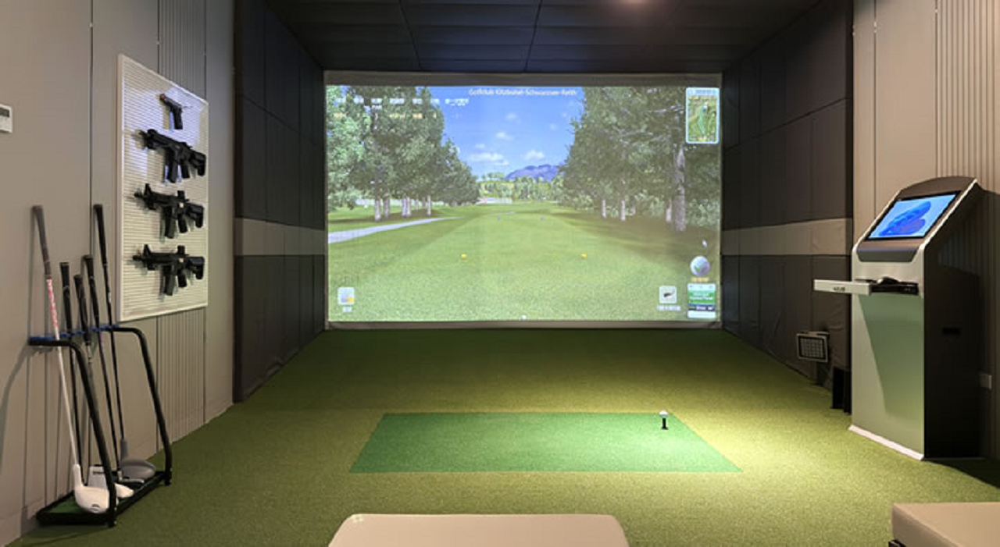
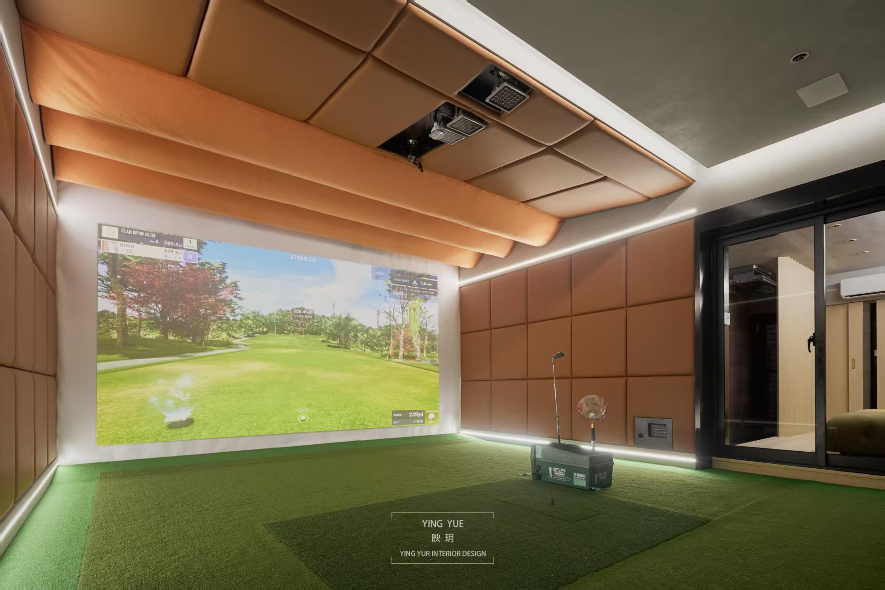
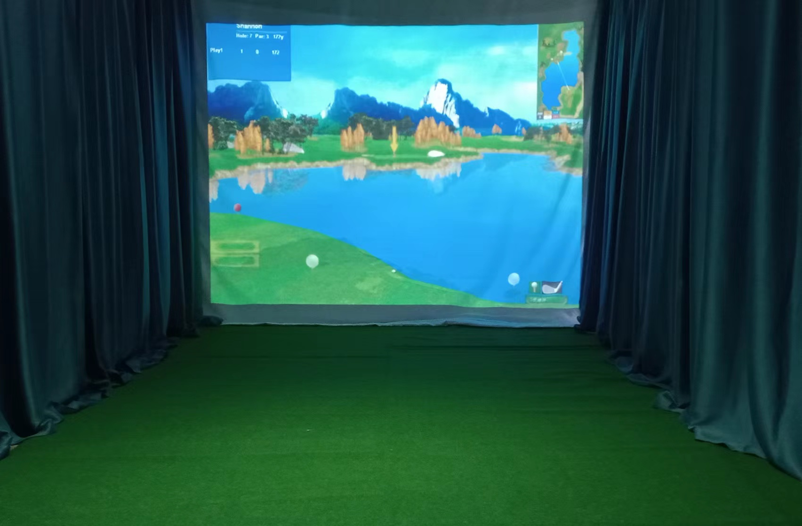
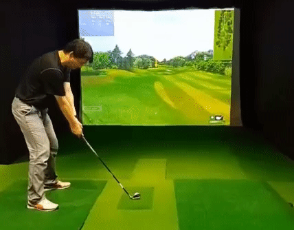

# ONEPP 室内高尔夫+射击+体能训练复合馆 · 合伙人招募计划书

## 1. 项目概述

**项目名称**：ONEPP Indoor Golf & Shooting & Fitness  
**项目定位**：以自研低成本模拟器为核心，打造「高尔夫 + 射击 + 专业体能训练」三合一社区微型连锁服务中心。  
**核心口号**：¥999 入会，¥50/小时起，无大额预存，想玩就玩。  

**商业模式**：总部提供设备、软件、统一服务管理；当地合伙人提供场地和日常接待；按营业额分成。  
**目标市场**：中国大陆二三线城市及一线城市非核心商圈，聚焦 18-45 岁年轻人群、家庭亲子、公司团建及高尔夫爱好者。

---

## 2. 市场痛点与解决方案

### 2.1 现有痛点
- **价格高**：传统室内高尔夫模拟器硬件成本 5-20 万元/台，导致客单价 150-300 元/小时，普通消费者望而却步。
- **预付费风险**：多数球馆要求一次性充值数千至上万元，频繁出现“跑路”新闻，用户信任度低。
- **玩法单一**：仅有高尔夫练习，缺乏复合娱乐元素，难以吸引非球友。
- **专业门槛高**：现有球馆偏向专业训练，新手缺乏趣味引导和低压力环境。
- **训练体系缺失**：绝大多数室内高尔夫球馆没有配套体能训练设备，球友无法在店内完成力量、爆发力等专项训练。

### 2.2 我们的解决方案
| 痛点 | ONEPP 方案 |
|------|-------------|
| 价格高 | 自研 DTG3 模拟器，成本仅为行业平均 1/10（约 ¥1.2 万/台），支持 ¥50-80/小时定价。 |
| 预付费风险 | 首次入会仅需充值 ¥999，后续按次扣费，且支持单次付费（不充值 +10%）。余额随时可退。 |
| 玩法单一 | 高尔夫 + 射击 + 体能训练，三种业态自由切换，可玩挑战小游戏、多人对战。 |
| 专业门槛高 | 提供趣味教学模式、新手教程视频，并配有线上教练答疑。 |
| 训练体系缺失 | 每店配备多功能体能训练器 + 挥杆平面练习器，会员可自助训练或预约教练课程。 |

### 2.3 竞争定位（不依赖竞品技术参数）
我们不与如歌、GOLFZON 等品牌直接比较技术参数，而是重新定义目标客群：
- **新手友好**：降低入门难度，让没打过球的人也能 5 分钟内上手。
- **休闲社交**：可和朋友对战、玩积分赛，更像“高尔夫主题的游戏厅”。
- **跨界体验**：射击模拟器带来新鲜感，体能训练则满足专业球友和健身人群。
- **一站式训练**：从挥杆技术到身体能力，所有需求在同一空间完成。

**已验证体验**：欢迎任何潜在合伙人/投资人前往厦门测试店试打，或观看[实际测试视频](https://onepp.tech/index.php/video/dtg3-%e7%81%ab%e6%98%9f%e4%ba%ba%e5%bd%b1%e7%89%87/)。

---

## 3. 技术与产品

### 3.1 DTG3 高尔夫模拟器
- 核心技术：自研三高速摄像三重传感，延迟 <0.5 秒，落点误差 ≤4%。
- 软件功能：内置超过 30 个世界知名球场（3D 渲染），支持联网对战、挥杆回放、数据统计。
- 成本：硬件 BOM 约 ¥1.2 万元（不含显示器/投影），对比行业均价 ¥10-20 万。

### 3.2 ShootSim 射击模拟器
- 支持手枪、步枪模式，可进行靶场训练、计时挑战、双人对战。
- 与高尔夫模式共用同一套主机和投影，一键切换。

### 3.3 高尔夫专业体能训练区

#### 多功能体能训练器（DISCOVER-115A PLUS）
- 商用级综合训练设备，单人站多功能缆绳系统
- 支持旋转推、伐木式、面拉、下拉等 **20+ 种高尔夫专项训练动作**
- 针对旋转力量、核心稳定性、挥杆爆发力等专业需求
- 承重 300KG，专业钢缆传动系统，安全护罩采用高密度高韧性纤维网
- 尺寸紧凑：1760×1050×2050mm，完美适配社区小店空间
- **单台成本：¥2,649**

#### 挥杆平面轨迹练习器
- 可调节角度/高度，帮助球友直观理解挥杆平面
- 专业教学辅助工具，提升教练教学效率，改善学员挥杆轨迹
- 会员可独立使用，延长停留时间，带动二次消费
- **单台成本：¥1,980**

**体能训练设备组合成本：¥4,629 / 店**

### 3.4 知识产权保护
- DTG3 核心算法已申请软件著作权。
- 软件采用授权激活机制，防止非法复制。

---

## 4. 运营模式与合伙人制度

### 4.1 总部与合伙人分工

| 角色 | 责任 |
|------|------|
| **总部（ONEPP 团队）** | ① 提供所有设备（模拟器、射击系统）；② 远程统一管理服务（预订、课程、技术支持、投诉处理）；③ 制定 SOP 并远程/巡店监督；④ 统一品牌营销及线上获客（抖音、小红书、美团）；⑤ 提供教练培训及在线教学系统。 |
| **当地合伙人** | ① 提供 50-70 平方米场地（租赁或自有）；② 办理当地营业执照；③ 承担场地租金、水电、网络、日常保洁；④ 负责前台接待及简单设备开关机（可自己做或雇兼职）；⑤ 按总部 SOP 执行服务。 |

### 4.2 服务标准化与质量控制
- 所有用户预订、支付、点评均通过总部统一的小程序完成。
- 每家店安装远程监控摄像头（仅公共区域），总部每日抽查服务流程。
- 合伙人每月参加一次总部线上运营会议，每季度总部巡店一次。
- 用户满意度评分连续低于 4.0/5.0 的店铺，总部有权派驻临时店长（费用由合伙人承担）。

### 4.3 收益分配

| 收入项 | 分配方式 |
|--------|----------|
| 场地使用费（高尔夫/射击，按小时） | 总部 30% ，合伙人 70% |
| 饮料零食销售 | 合伙人 100% |
| 教练课程（含体能训练课） | **总部 50% ，合伙人 50%** （自动分账） |
| 活动包场 | 总部 20% ，合伙人 80% |

> 体能训练设备产生的独立课程收入同样适用 50%:50% 分成。

### 4.4 合伙人投入
- 一次性设备押金：¥2 万元/单元，双单元店共 ¥4 万（合同期满可退）。
- 电脑及激光投影仪：由总部统一采购，合伙人按成本价 **¥1.5 万/店** 购置。
- 首次软件授权费：¥0（前 12 个月免收，之后每年 ¥3000/店）。
- 场地装修：建议简约风格，预算 ¥3-5 万（自行承担）。
- **体能训练设备采购**：¥4,629（一次性购买，归合伙人所有）。
- 无加盟费、无管理费（仅营业额分成）。

---

## 5. 财务计划与融资需求

### 5.1 单店模型（双单元店，约70㎡）

**初始投入**：

| 项目 | 金额（¥） | 备注 |
|------|-----------|------|
| 高尔夫+射击模拟器设备（2 单元） | 20,000 × 2 = 40,000 | 含传感器、打击幕、软件授权 |
| **电脑 + 激光投影仪（2 套）** | **15,000** | **由总部提供，合伙人按成本价购置** |
| 体能训练设备 | 4,629 | 多功能训练器 + 挥杆练习器 |
| 装修及家具 | 30,000 - 50,000 | 简约风格 |
| 首次租金+押金（按 3 个月） | 15,000 - 24,000 | 月租 5000-8000 |
| 纳客管理系统（智能门禁/灯控） | 6,500 - 10,000 | 按 2 单元计 |
| 其他（招牌、音响、监控、耗材） | 8,000 - 15,000 | 含打击垫、营销物料等 |
| **总投资（含可退押金¥4万）** | **约 ¥119,129 - ¥158,629** | 取平均约 **¥13.9 万** |
| **净投入（扣除¥4万押金）** | **约 ¥79,129 - ¥118,629** | 取平均约 **¥9.9 万** |

**月运营预测（含体能训练收入）**：

| 项目 | 保守 | 中性 | 乐观 |
|------|------|------|------|
| 日均有效使用小时（每单元） | 2h | 3.5h | 5h |
| 客单价（¥/小时，高尔夫/射击） | 60 | 70 | 80 |
| 月场地收入（2 单元） | 7,200 | 14,700 | 24,000 |
| 体能训练收入（课程+自助） | 500 | 2,000 | 4,000 |
| 饮料/小食收入 | 500 | 1,200 | 2,000 |
| 教练课程分成（合伙人50%） | 300 | 1,000 | 2,000 |
| **月总收入** | **8,500** | **18,900** | **32,000** |
| 月租金+水电 | -6,000 | -6,500 | -7,500 |
| 月人工（兼职前台） | -1,000 | -1,500 | -2,000 |
| 其他杂费 | -500 | -500 | -500 |
| **月净利润（税前，合伙人所得）** | **1,000** | **10,400** | **22,000** |

✅ **核心结论**：  
- 保守情况下月净利约 ¥1,000，现金流转正。  
- 中性情况下 **净投入约10万，月净利10,400，回本周期约9-10个月**。  
- 每天每单元仅需使用 **2.4 小时** 即可达到损益平衡点（含体能收入）。

### 5.2 总部收益预测（按 12 家店，中性情景）
- 单店月营业额 ¥18,900 → 总部分成：场地费 30% 约 ¥5,670 + 教练课程 50% 约 ¥1,000 = ¥6,670。
- 12 家店月总部收入：¥80,040。
- 扣除总部团队成本（技术维护、市场、客服等约 ¥5.5 万/月），月净利润约 ¥25,040。
- 随着店铺数量增加，总部利润率显著提升。

---

## 6. 风险与应对

| 风险 | 应对措施 |
|------|----------|
| **技术性能不足** | 开放厦门测试店及视频链接，欢迎实地试打；收集用户反馈持续优化算法。 |
| **消费者预付费不信任** | 仅需充值 ¥999，且支持单次付费（不充值 +10%）。余额随时可退，写入合同。 |
| **合伙人管理混乱** | 总部统一服务管理 + 远程监控，降低对合伙人能力要求。违约可终止合作并收回设备。 |
| **体能设备使用率低** | 提供标准训练课程模板，总部协助对接本地教练；推出“月度畅练卡”打包模拟器+体能。 |
| **竞争对手模仿** | 持续迭代软件（每月新增球场/射击模式），建立品牌认知和用户社群。 |
| **资金链断裂** | 首年开店数量控制在 12-18 家，预留至少 6 个月流动资金。若融资不足，可先开 8 家验证模型。 |

---

## 7. 团队与背景

ONEPP 研发团队:  台湾新竹交通大学资深硬件工程师领导台湾团队开发,自2015年立项开发,历经三代,十年磨一剑!
我们的研发初心: 高尔夫模拟器,高贵可以不贵!

---

## 8. 下一步行动

**对合伙人的邀请**：
- 欢迎有场地资源（50-70 平，月租低于 ¥8000）的潜在合伙人联系我们。
- 首批合作的前 10 家店，总部免除第一年软件授权费（价值 ¥3000/年），并额外提供开业营销支持。

**对投资人的邀请**：
- 我们正在寻找种子轮/天使轮投资人，融资金额 ¥500-800 万。
- 可安排厦门测试店参观及技术演示。

**联系方式**：微信:hsiehinsuan

---
*本计划书仅供参考，不构成投资承诺。最终条款以正式协议为准。*

